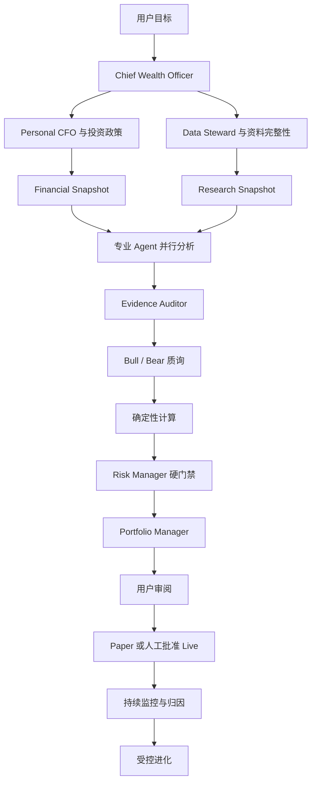

# WealthPilot：专业个人财富管理管家团项目计划

## 1. 产品定位与目标

WealthPilot 是面向个人用户的专业财富管理管家团。系统以完整资产负债、现金流、财务目标和风险承受能力为基础，组织多个专业 Agent 持续完成资产管理、财务规划、投资研究、组合风控、交易协助和投后复盘。

最终产品必须完成：

1. 建立持续准确的个人资产负债表；
2. 管理流水、预算、债务、保险和长期财务目标；
3. 主动发现并理解财报、公告、合同、法规和授权研究资料；
4. 查询行情、财务指标、新闻、行业和宏观数据；
5. 完成个股研究、同行比较和全市场条件选股；
6. 根据个人财务约束生成资产配置、仓位和交易建议；
7. 支持回测、模拟交易和人工逐单批准的 QMT 实盘；
8. 持续监控资产、持仓、公告、风险和投资逻辑；
9. 根据用户反馈和真实结果生成受控改进候选；
10. 让每个结论、计算、建议和订单可追踪、可复算、可审计。

固定原则：

- 用户拥有最终决策权，Agent 不得自主实盘交易；
- 金额、仓位、回测和硬风险计算由确定性代码完成；
- 投资结论必须绑定 Evidence Ledger 和数据截止时间；
- 个人财务约束优先于证券投资机会；
- 数据不足时输出不足以决策，不得强行给出方向；
- 原始个人数据保存在用户设备；
- 云模型只接收最小化、必要且经过脱敏的上下文；
- 风控、权限和审批规则不能被 Agent 修改；
- 历史研究必须使用当时可获得的数据复现。

不包含多租户 SaaS、高频交易、杠杆衍生品、Agent 自主实盘、绕过付费访问控制、模型直接执行 SQL 或任意代码。

## 2. 财富管理管家团

### 2.1 组织角色

| 角色 | 职责 | 核心 Artifact |
|---|---|---|
| Chief Wealth Officer | 识别目标、生成计划、选择团队、分配预算、汇总建议 | `WealthManagementPlan` |
| Personal CFO | 资产负债、现金流、应急资金、可投资资金 | `FinancialSnapshot` |
| Account Steward | 文件导入、去重、分类、对账 | `ReconciliationReport` |
| Goal Planner | 财务目标、资金缺口、成功概率 | `GoalPlan` |
| Asset Allocation Strategist | 目标配置、风险预算、再平衡 | `AssetAllocationPlan` |
| Insurance and Debt Analyst | 保障缺口、债务成本、提前还款 | `ProtectionAssessment` |
| Financial Intelligence Agent | 资料发现、下载、版本和覆盖度 | `CoverageManifest` |
| Data Steward | 数据质量、时点校验并冻结研究输入 | `ResearchSnapshot` |
| Document Analyst | 文档结构、表格、事实、条款和原文定位 | `DocumentEvidenceReport` |
| Research Director | 股票研究拆解、同业选择、补充调查 | `ResearchPlan` |
| Fundamental Analyst | 商业模式、财务质量、治理 | `FundamentalReport` |
| Valuation Analyst | 相对估值、DCF、情景和安全边际 | `ValuationReport` |
| Industry Analyst | 行业周期、产业链、竞争格局和同业 | `IndustryComparisonReport` |
| Technical and Quant Analyst | 趋势、因子、回测、流动性和仓位 | `QuantReport` |
| News and Macro Analyst | 公司事件、政策和宏观传导 | `EventAndMacroReport` |
| Bull Researcher | 最强看多论据、催化剂和验证条件 | `BullCase` |
| Bear Researcher | 反方证据、损失路径和失效条件 | `BearCase` |
| Evidence Auditor | 引用、单位、期间、来源和时点检查 | `EvidenceAudit` |
| Risk and Compliance Manager | 现金、集中度、回撤、交易和账户硬约束 | `RiskAssessment` |
| Portfolio Manager | 综合适配性、研究和风险形成结论 | `DecisionMemo` |
| Execution Steward | 订单建议、审批、执行和对账 | `OrderProposal` |
| Performance and Evolution Agent | 结果归因、失败分类和改进候选 | `EvolutionCandidate` |

### 2.2 协作流程



Agent 之间只传递版本化 Pydantic Artifact。Trace 展示任务、工具、证据、Artifact、成本、延迟和结论摘要，不展示模型隐藏思维链。

## 3. 用户产品

### 3.1 财富驾驶舱

- 净资产、总资产、总负债和可投资资产；
- 十二个月现金流和预算；
- 应急资金月数和财务目标；
- 资产类别、市场、行业和单标的暴露；
- 财务风险、组合风险和待审批事项；
- 指标计算口径和原始数据下钻。

### 3.2 流水与预算中心

- 支付宝、微信、银行、信用卡和券商文件导入；
- 来源识别、字段映射、去重、退款、分期和转账识别；
- 规则优先的消费分类；
- 预算、周期性支出、订阅和异常消费；
- 批量操作预览、冲销和审计。

### 3.3 财务规划中心

- 应急资金、教育、购房、旅行和退休目标；
- 储蓄率、目标缺口和成功概率；
- 提前还贷与投资机会成本；
- 失业、医疗和大额消费情景；
- 保险责任与保障缺口；
- Investment Policy Statement。

### 3.4 金融情报与文档中心

- 上传与自动资料补全；
- 下载、解析和覆盖度进度；
- 文档树、问答、比较、条款和计算；
- PDF 原文、页码、表格和证据高亮；
- 来源、报告期、类型和版本筛选；
- 检索过程、公式、冲突和使用关系。

### 3.5 股票研究工作台

支持个股研究、同行比较、自然语言选股、持仓诊断、事件影响分析和自选股监控。展示行情、数据截止时间、资料覆盖度、Agent 任务树、专业报告、Bull/Bear、矛盾矩阵、估值情景、回测、个人适配性、风险、失效条件和 Decision Memo。

### 3.6 投资组合与交易中心

- 持仓批次、收益、回撤、集中度和流动性；
- 行业、风格和因子暴露；
- 再平衡建议和情景压力测试；
- Paper 与 Live 隔离；
- 订单建议、风控、人工审批、成交和对账；
- 交易决策日志。

### 3.7 评测与进化中心

- Agent、Prompt、Tool 和模型版本；
- 事实正确率、引用准确率、成本和延迟；
- 失败分类和历史研究表现；
- Champion–Challenger；
- 人工批准和回滚记录。

## 4. 个人财富数据模型

### 4.1 双重记账

核心实体：`LedgerAccount`、`JournalEntry`、`Posting`、`ImportBatch`、`Reconciliation`、`CategoryRule`。

约束：

- 每笔 JournalEntry 借贷平衡；
- 已入账数据通过冲销和新分录修改；
- 导入批次保存文件哈希、来源和解析器版本；
- 来源记录具有稳定幂等键；
- 金额使用 `Decimal`，API 使用字符串传输。

双重记账用于避免多账户导入、转账、退款和分期造成净资产静默漂移。

### 4.2 资产负债与投资政策

核心实体：`Asset`、`Liability`、`ValuationSnapshot`、`HoldingLot`、`PortfolioSnapshot`、`CashflowForecast`、`FinancialGoal`、`RiskProfile`、`InvestmentPolicyStatement`。

Investment Policy Statement 包含最低现金储备、可投资资金上限、目标配置、权益上限、单股与行业上限、最大回撤、投资期限、允许品种、禁止标的和再平衡规则。

### 4.3 确定性财务引擎

实现收支、储蓄率、净资产、负债率、应急资金、预算、现金缺口、IRR、XIRR、NPV、CAGR、贷款摊销、提前还款、目标储蓄、Monte Carlo 成功率、可投资资金和保险保障缺口。LLM 只解释结果。

## 5. 主动金融情报与证据系统

### 5.1 触发与获取

支持用户上传、研究触发、事件触发和定时触发。

```text
证券身份解析
→ 资料需求生成
→ CoverageManifest 检查
→ 缺失和过期识别
→ 授权来源选择
→ 下载与安全检查
→ 公司、代码和报告期校验
→ 哈希去重与版本识别
→ 文档解析与事实抽取
→ 索引与质量检查
→ 覆盖度更新
→ ResearchSnapshot
```

来源优先级为法定披露平台、上市公司投资者关系网站、政府监管与统计来源、用户授权供应商、明确出处的公开新闻、待验证公开网页。未授权付费内容不得下载正文。

### 5.2 Coverage Manifest

单股深度研究默认要求最近三年年报、最近四个季度报告、最近一年重大公告、最近两年监管问询与回复、最近六个月投资者关系记录、最新审计意见、最新业绩预告或快报、主要同业同期数据及相关产业政策。

`CoverageManifest` 保存可用、缺失、过期和冲突资料及完整度。覆盖度必须进入最终报告。

### 5.3 文档解析和存储

支持 PDF、DOCX、XLSX、HTML 和 CSV。Docling 负责版面、目录、阅读顺序和表格，中文扫描页由 PaddleOCR 回退。`DocumentBlock` 保存页码、章节、类型、坐标、原文、标准化文本、实体、期间、单位、哈希、解析器版本和质量。

数据分为加密原始对象、PostgreSQL 元数据、Qdrant Dense 向量、Sparse/BM25、结构化财务事实、新闻事件和行情时序。

### 5.4 检索与证据

```text
实体和意图识别
→ 数据源路由
→ Metadata Filter
→ Dense + Sparse
→ RRF
→ Rerank
→ Evidence Consolidation
→ 冲突与充分度检查
→ 必要时增量检索
```

`EvidenceFact` 保存实体、主张、值、单位、币种、期间、来源、文档页码、Block、引用、来源权威性、解析质量、检索分数和冲突状态。重要结论必须引用 `fact_id`。

### 5.5 金融计算 DSL

LLM 只生成白名单计算计划。解释器读取事实、校验期间和单位、执行计算并保存中间结果。禁止 `eval()`、`exec()` 和任意 Python 执行。

## 6. 股票研究与智能选股

### 6.1 Research Plan 与 Snapshot

`ResearchPlan` 定义任务类型、标的、截止时间、必需资料、市场数据、指标、同业选择、宏观主题、Agent 任务和预算。

`ResearchSnapshot` 冻结行情、财务、文档、新闻、宏观、同业、个人财务、组合、模型、Prompt 和 Tool 版本。历史研究和回测只能引用快照。

### 6.2 专业研究

个股研究覆盖商业模式、产品与收入、盈利能力、现金流、资产负债、资本效率、治理、行业地位、竞争优势、估值、技术、量化、新闻、政策、宏观、催化剂、风险和失效条件。

同行比较统一对齐会计期间、币种、单位、合并口径、一次性项目和行业分类，比较增长、利润率、ROE、ROIC、现金流、应收、存货、资本开支、负债、研发、市占率、估值和治理风险。

### 6.3 自然语言选股

```text
自然语言
→ ScreeningSpec
→ 注册字段、单位和时点校验
→ 条件解释预览
→ 确定性查询
→ 硬条件过滤
→ 因子排名
→ Top-K 资料补全
→ Multi-Agent 深度研究
→ 候选排序与组合匹配
```

LLM 不生成可执行 SQL。全市场筛选由确定性引擎完成，Agent 只研究 Top-K 候选。

### 6.4 Bull/Bear 与审计

Bull 和 Bear 独立形成观点并引用 Evidence Ledger，随后相互质询三项核心观点，对争议事实申请一次补充调查并生成 `ContradictionMatrix`。Evidence Auditor 检查后由 Portfolio Manager 根据证据质量、覆盖度、可证伪性、安全边际、风险收益比和个人约束裁决。

### 6.5 Decision Memo

`DecisionMemo` 包含标的、截止时间、Research Snapshot、评级、置信度、覆盖度、个人适配性、投资逻辑、反方证据、公允价值区间、情景、目标仓位、最大金额、入场条件、退出条件、失效条件、风险、证据和版本。

## 7. 投资组合、回测与交易

### 7.1 回测

事件驱动回测支持 A 股股票、ETF、基金、复权、分红、停牌、涨跌停、最小交易单位、T+1、费用、印花税、滑点、基准、Walk-forward、Point-in-Time 数据和多标的组合。

输出 CAGR、超额收益、Sharpe、Sortino、Calmar、最大回撤、波动率、Beta、Turnover、交易成本、行业与因子暴露、市场阶段表现和参数稳定性。

### 7.2 仓位与硬风控

目标仓位取个人可投资资金、现金储备后余额、单股上限、行业容量、权益上限、风险预算、流动性容量和最大可承受损失的最小值。

硬风控包括现金储备、仓位、行业、权益、单笔和单日额度、回撤锁定、禁止标的、ST、停牌、退市、数据延迟、重大事件、价格偏离、可用资金、可卖数量和环境隔离。

### 7.3 订单与 QMT

`OrderProposal` 是不可变限价订单建议，包含账户、标的、方向、数量、限价、滑点、过期时间、Decision Memo、风控版本、幂等键和环境。

```text
DecisionMemo
→ OrderProposal
→ 本地硬风控
→ 用户审阅
→ Paper 或 WebAuthn 逐单批准
→ Ed25519 签名订单
→ Windows QMT Gateway
→ 网关二次风控
→ MiniQMT / xtquant
→ 回报与对账
```

网关不接收自然语言；Broker 凭据不离开 Windows；订单使用 mTLS、nonce、过期时间和幂等键；未知状态不得自动补单；默认启用 Kill Switch 和异常只读降级。

## 8. 云模型与 Agent Harness

### 8.1 Model Gateway

所有生成式 Agent 统一使用云模型 API。国内 OpenAI-Compatible API 为默认 Provider，保留 OpenAI、Anthropic 和测试用 Fake Adapter。模型任务分为 FAST、STANDARD、DEEP、CRITIC，关键决策使用不同 Provider 独立复核。

Model Gateway 实现限流、重试、超时、熔断、健康检查、Provider 降级、Schema 校验、Token 与人民币成本预算、缓存、请求审计、敏感信息拦截和版本记录。

### 8.2 隐私

| 等级 | 内容 | 策略 |
|---|---|---|
| P0 | 公开市场和公司资料 | 可发送云模型 |
| P1 | 匿名汇总和风险指标 | 脱敏后发送 |
| P2 | 流水、持仓、合同和账户明细 | 原文禁止发送，只发送必要事实 |
| P3 | 密码、Token、银行卡和签名密钥 | 永不进入模型上下文 |

无法安全脱敏时停止模型调用。云模型不可用时，账本、筛选、计算和风控继续运行，Agent 综合分析保存 Checkpoint 后暂停。

### 8.3 Harness

LangGraph 承担状态图，自研 Harness 承担 Agent/Tool Registry、类型化 Handoff、并行依赖图、预算、Checkpoint、Resume、Replay、Retry、Timeout、Circuit Breaker、Context Compression、Human-in-the-loop、Tool 权限、幂等、补偿、Trace 和 Evaluation Harness。

## 9. 技术架构

技术栈：Python 3.12、FastAPI、Pydantic v2、SQLAlchemy 2、Alembic、LangGraph、Celery、Redis、PostgreSQL 16、Qdrant、Docling、PaddleOCR、Next.js、TypeScript、Tailwind、shadcn/ui、TanStack Query、ECharts、OpenTelemetry、Docker Compose、`uv`、`pnpm`。

模块边界：Web、API、Worker、QMT Gateway、Domain、Harness、Model Gateway、Finance、Market Data、Intelligence、Documents、RAG、Research、Screener、Quant、Risk、Broker、Evolution、Evals 和 Infra。

固定数据规则：金额使用 Decimal；时间存 UTC、展示 Asia/Shanghai；市场数据记录来源和可用时点；Agent 不直接访问数据库；LLM 不执行 SQL；写操作使用幂等键；关键事件 append-only；修订资料保留全部版本；研究绑定不可变快照。

## 10. API 与实时事件

公开 API 使用 `/api/v1`，覆盖 imports、wealth、documents、coverage、evidence、research、screeners、comparisons、portfolio、backtests、orders、evolution、model-gateway、qmt 和 notifications。

SSE 事件包括 `run.started`、`plan.created`、`coverage.checked`、`source.discovered`、`document.downloaded`、`document.parsed`、`evidence.added`、`task.started`、`tool.called`、`task.completed`、`debate.started`、`risk.blocked`、`approval.required`、`run.completed` 和 `run.failed`。

错误包含 `error_code`、用户信息、Trace ID、阶段、可重试性、部分 Artifact、Checkpoint 状态和恢复动作。

## 11. 主动服务

- 每日 07:30：现金、预算和财务风险摘要；
- 交易日 09:15：持仓、自选股公告和事件；
- 交易日 15:30：持仓、成交和组合对账；
- 每周日 20:00：周度财富与投资简报；
- 每月最后一天：月度财务报告；
- 财报、重大公告、监管问询、预算超限和逻辑失效即时提醒。

电脑关机后任务在下次启动补跑一次。邮件只包含低敏摘要和应用链接。

## 12. 记忆与自进化

记忆分为 Semantic、Episodic、Procedural 和 Evidence。每条记忆保存来源、作用域、创建时间、有效期、置信度、状态、关联研究和版本。

可进化对象包括 Prompt、Tool Description、Query Rewrite、Source Ranking、Chunk/Top-K/Rerank 参数、Agent 路由、流水分类规则、Context Compression 和 Procedural Skill。

禁止进化风险上限、审批流程、Broker 权限、密钥处理、实盘开关和生产代码发布。

```text
反馈或结果
→ 失败分类与根因归类
→ 单变量候选
→ 金融问答、检索和研究回放
→ Walk-forward
→ 安全、隐私和成本回归
→ Champion–Challenger
→ 人工批准
→ 灰度
→ 保留或回滚
```

## 13. 测试与验收

- Golden Ledger 借贷平衡率 100%，重复分录为 0；
- 金额、贷款、IRR、XIRR 和现金流 Golden Tests 100% 通过；
- 必需公开文档发现成功率目标不低于 95%；
- 文件哈希去重和修订版识别准确率 100%；
- Evidence Recall@10 不低于 90%；
- 引用页码、单位、期间和口径准确率不低于 95%；
- 重要结论证据覆盖率不低于 95%；
- ScreeningSpec 与确定性基准结果一致率 100%；
- 文档 Prompt Injection 触发 Tool 次数为 0；
- 回测未来数据泄漏测试 100% 通过；
- Harness 超时、预算、恢复和幂等测试 100% 通过；
- P2/P3 原文泄漏数量为 0；
- 无人工批准实盘订单数为 0；
- 重试产生的重复订单数为 0；
- 未批准进化候选影响生产版本次数为 0。

## 14. 16 周实施计划

| 周期 | 交付能力 | 验收 |
|---|---|---|
| 第 1 周 | Monorepo、Compose、CI、领域基类、数据库和 Trace | 一条命令启动基础服务 |
| 第 2 周 | Model Gateway、Harness、隐私检查、Checkpoint 和 SSE | Provider 故障可恢复且敏感数据不泄漏 |
| 第 3–4 周 | 双重记账、导入、对账、资产负债、预算和现金流 | 合成一年数据生成准确资产负债表 |
| 第 5 周 | 财务目标、贷款、保险、Monte Carlo 和 IPS | 生成财务计划和可投资资金上限 |
| 第 6–7 周 | Source Registry、自动发现、Coverage、解析和文档工作台 | 自动补齐必需财报和公告 |
| 第 8 周 | Hybrid RAG、Evidence Ledger、原文高亮和计算 DSL | 跨文档答案具备证据和可复算公式 |
| 第 9–10 周 | 专业投研 Agent、Bull/Bear、审计、Snapshot 和 Memo | 生成完整可审计个股报告 |
| 第 11 周 | ScreeningSpec、确定性选股、Top-K 和同行比较 | 自然语言筛选与人工规则一致 |
| 第 12 周 | A 股回测、Walk-forward、组合风险和目标仓位 | 历史任务严格使用当时数据 |
| 第 13 周 | Paper Broker、订单闭环、主动报告和监控 | 模拟订单完整闭环且通知不重复 |
| 第 14 周 | 四类记忆、归因、候选、评测和回滚 | 未批准版本不生效 |
| 第 15 周 | QMT、mTLS、签名、WebAuthn、幂等和 Kill Switch | 故障与重试不产生重复订单 |
| 第 16 周 | 故障注入、安全、性能、合成数据和秋招交付 | 完成一键 Demo 和公开材料 |

## 15. 最终演示

1. 导入合成个人账单；
2. 生成资产负债表；
3. 创建财务目标；
4. 输入自然语言选股条件；
5. 查看确定性筛选；
6. 自动下载财报和公告；
7. 展示文档证据和 Multi-Agent 进度；
8. 查看基本面、估值、同行、Bull/Bear 和风险；
9. 结合个人现金流计算目标仓位；
10. 创建、批准和执行模拟订单；
11. 查看持续监控和结果归因；
12. 提交用户纠正并查看受控进化与回滚。

## 16. 最终交付物

- WealthPilot Web/PWA；
- 专业个人财富管理 Agent 团队；
- 双重记账、资产负债和财务规划；
- 主动金融情报与证据中台；
- 金融文档 RAG 和计算 DSL；
- 个股研究、同行比较和自然语言选股；
- 回测、组合风险和模拟交易；
- 人工批准 QMT 实盘网关；
- 主动报告与事件预警；
- Model Gateway 和 Agent Harness；
- 记忆、自进化和 Evaluation Harness；
- 合成演示数据、API 文档、架构、安全、隐私和评测报告；
- 演示视频、简历项目描述和面试材料。

## 17. 固定实施假设

- 单用户、本地数据优先、A 股优先；
- 支持股票、ETF 和基金，不支持衍生品和杠杆；
- 所有生成式 Agent 使用云模型 API；
- 国内 OpenAI-Compatible API 为默认 Provider；
- 保留 OpenAI 和 Anthropic Adapter；
- 不依赖 Ollama 和本地 GPU；
- 原始个人数据不发送云端；
- 免费公开数据源优先，增强数据源由用户授权；
- 研究报告只处理公开或已授权内容；
- 实盘和自进化均逐项人工批准；
- 风控和权限规则不可进化；
- 核心代码公开，真实数据、凭据和个人配置不公开；
- 主服务使用 Docker Compose，QMT 网关运行于 Windows；
- 实施周期为 16 周。
