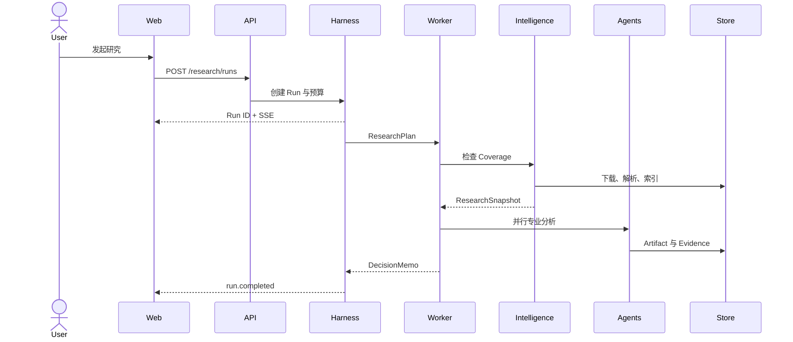
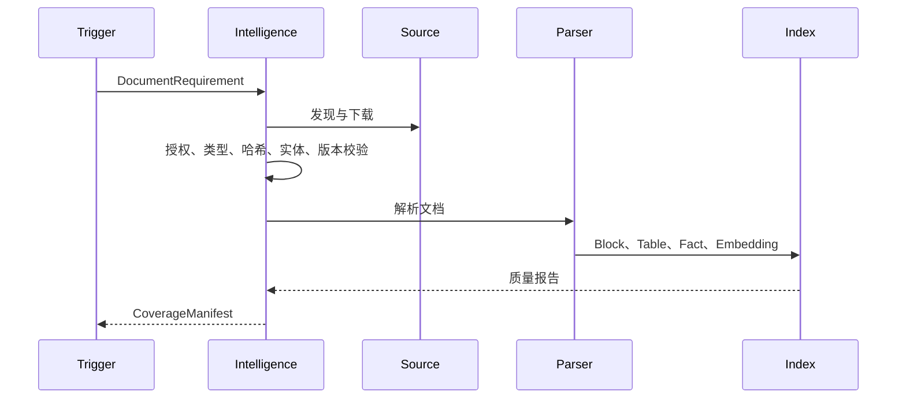
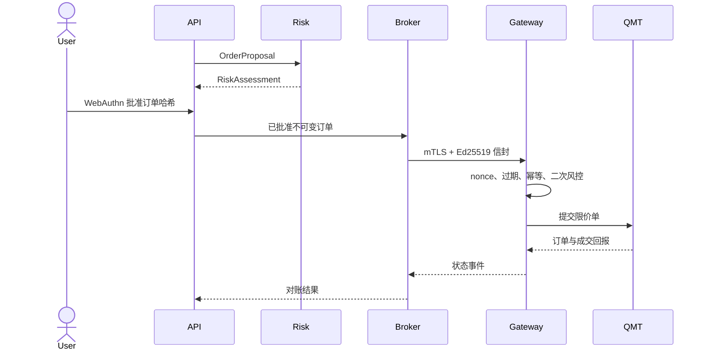

# 运行时架构

## 组件

| 组件 | 职责 |
|---|---|
| Next.js Web | 工作台、审批、Trace 和 SSE 消费 |
| FastAPI | 认证、公开 API、命令校验和查询 |
| Agent Harness | 状态图、预算、权限、Checkpoint 和 Trace |
| Celery Worker | 文档、研究、回测、报告和定时任务 |
| Scheduler | 每日、交易日、周度、月度和事件任务 |
| Model Gateway | 模型路由、隐私、成本、重试和审计 |
| Document Worker | 下载、校验、Docling、OCR、索引 |
| Notification Service | 应用内通知和低敏邮件 |
| PostgreSQL | 领域数据、状态、审计和 Sparse 检索 |
| Qdrant | Dense 向量检索 |
| Redis | 队列、锁、短期状态和事件分发 |
| QMT Gateway | Windows 账户、行情和订单隔离网关 |

## 研究任务

## 文档入库

## 订单执行

## 恢复语义

- 每个有副作用节点前写入意图与幂等键；
- 完成节点提交 Artifact 和 Checkpoint；
- 重启从最后成功 Checkpoint 恢复；
- 外部调用未知时先查询状态，不重放写操作；
- 取消任务停止新节点，已完成 Artifact 保留。
