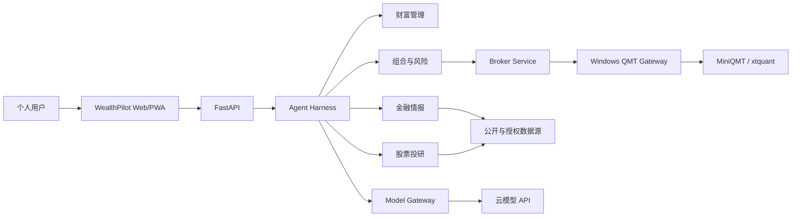

# 系统上下文

## 边界

## 系统内职责

- 个人账户、账本、资产负债和目标；
- 文档发现、解析、检索、证据和版本；
- 行情、财务、行业、新闻和宏观数据适配；
- Multi-Agent 财务与投资分析；
- 确定性财务、估值、回测和风险计算；
- Paper 交易和人工批准 Live 交易；
- 监控、通知、归因、评测和受控进化。

## 外部依赖

- OpenAI-Compatible、OpenAI 和 Anthropic 云模型接口；
- 交易所、上市公司、监管、统计、新闻和授权数据服务；
- SMTP 邮件服务；
- Windows QMT/MiniQMT 与券商账户。

## 信任边界

1. 浏览器到 API 使用本机认证会话；
2. 原始个人数据、账本、对象存储和密钥处于本地信任边界；
3. Model Gateway 是云模型数据出口的唯一边界；
4. 外部文档和网页一律视为不可信输入；
5. QMT Gateway 是实盘凭据和订单执行边界；
6. Paper 与 Live 使用独立账户、数据库标识和密钥。

## 固定约束

- 单用户、本地数据优先、A 股优先；
- 所有生成式推理经 Model Gateway；
- 实盘订单必须人工逐单批准；
- Agent 无法获得 Broker 凭据；
- 关键结论必须引用 Evidence Ledger。
