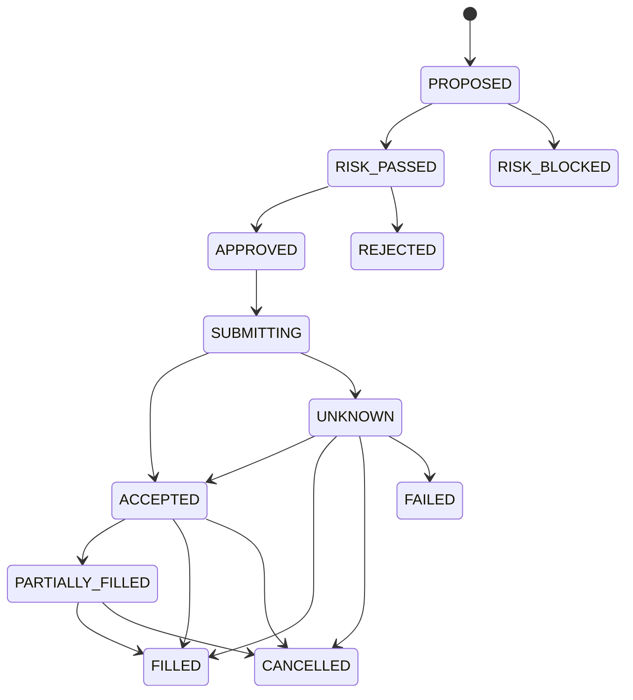

# 交易执行

## 环境

- Paper：模拟订单、成交和账户；
- Live：QMT 真实账户，只接受人工批准订单。

环境使用独立账户标识、数据库范围、密钥和审批策略。

## Order Proposal

OrderProposal 由 Execution Steward 根据 Decision Memo 生成，固定为限价单，包含账户、标的、方向、数量、限价、滑点、过期时间、决策引用、风控版本、幂等键和环境。

Proposal 创建后不可修改。任何字段变化创建新 Proposal。

## 状态机

`UNKNOWN` 状态只允许查询和对账，不允许自动重发。

## 审批

Paper 需要用户确认。Live 使用 WebAuthn 对 Proposal 哈希签名，批准记录保存用户、时间、订单哈希、风险版本和过期时间。批准不适用于其他 Proposal。

## QMT 信封

信封包含 Proposal、Approval、nonce、`issued_at`、`expires_at`、幂等键和 Ed25519 签名。传输使用 mTLS。Gateway 验证证书、签名、nonce、过期、环境和二次风控后调用 xtquant。

## 对账

Gateway 将订单、撤单和成交转换为版本化事件。Broker Service 使用券商订单 ID、幂等键和成交 ID 对账，更新持仓批次和现金账本。对账差异生成高优先级通知并暂停新 Live 订单。

## Kill Switch

Kill Switch 阻止新订单，保留账户查询、订单查询和撤单。启动 Live 前必须显式解除，服务重启后默认保持关闭交易状态。
